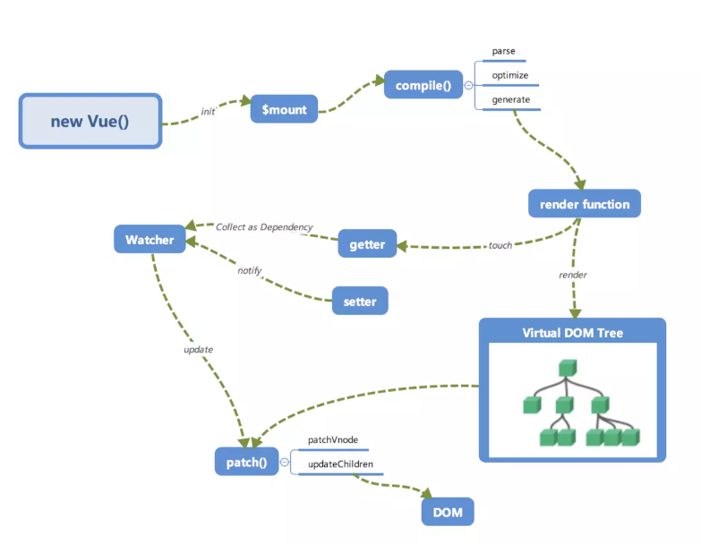
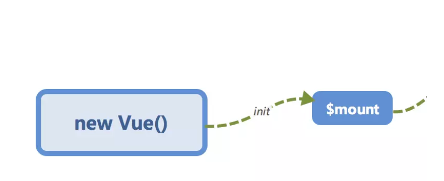
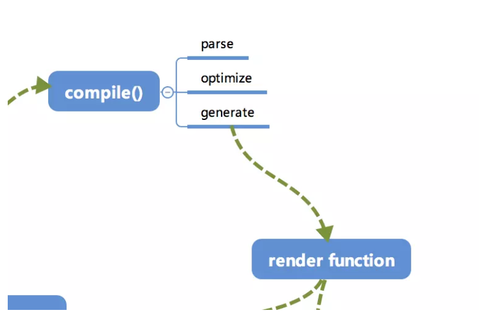
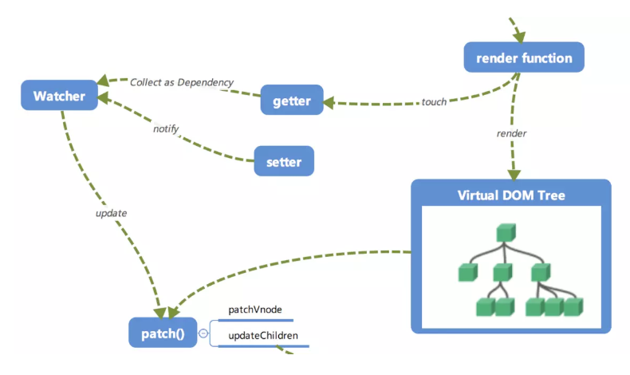
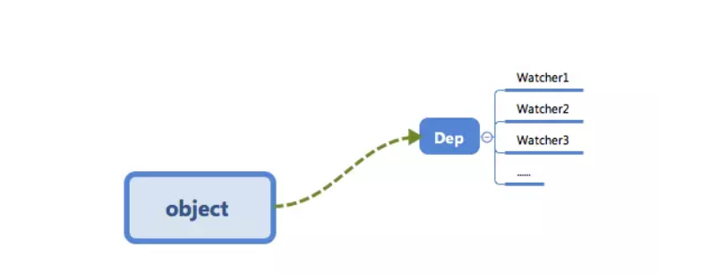
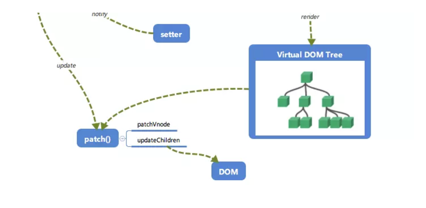

# Vue.js 运行机制全局概览

## 全局概览


上图一头雾水

## 初始化及挂载


在`new Vue()`之后. Vue 会调用`_init`函数进行初始化, 也就是这里的`init`过程,它会初始化生命周期、事件、props、methods、data、computed 与 watch 等. 其中最重要的是通过 `Object.defineProperty` 设置 与 `setter` 与 `getter` 函数, 用来 实现  [**响应式**] 以及 [**依赖收集**] ,后面会说.

初始化之后调用  `$mount` 会挂载组件, 如果是运行时编译, 即不存在 render function 但是存在 template 的情况, 需要进行 [**编译**] 步骤.

## 编译
compile 编译可以分成`parse`(分析)、`optimize`(优化)与`generate`(生成 使形成)三个阶段,最终需要得到 render function.



- #### parse (分析)

`parse` 会用正则等方式解析 template 模板中的指令、class、style等数据, 形成 AST.
==AST==
(abstract syntax tree 抽象语法树)

- ### optimize (优化)

`optimize`的主要作用是标记 static 静态节点, 这是 Vue 在编译过程中的一处优化,后面当`update`更新时,会有一个`path`的过程, diff 算法会直接跳过静态节点, 从而减少了比较的过程 , 优化了`patch`(修补 打补丁)的性能.

- ### generate (生成)

`generate` 是将 AST 转化成 render funciton 字符串的过程 , 得果是 render 的字符串以及 staticRenderFns 字符串.

在经历过`parse`、`optimize`与`generate`这三个阶段以后, 组件中就会存在渲染 VNode 所需的 render function 了.

## 响应式

Vue.js 响应式的核心部分


这里的 `getter` 跟 `setter` 已经 在之前介绍过了, 在 `init` 的时候通过 `Object.defineProperty` 进行了绑定, 它使得当被 设置 的读取的时候会执行 `getter` 函数, 而在当被赋值的时候会执行 `setter` 函数.

当 render function 被渲染时候, 因为会读取所需对象的值,所以会触发 `getter` 函数进行 [**依赖收集**],[**依赖收集**]的止的是将观察者 **Watcher** 对象存放到当前闭包中的订阅者 Dep(数据依赖) 的 subs 中. 形成如下所示的这样一个关系.



在修改对象的值的时候, 会触发对应的 `setter`、`setter` 通知之前 [**依赖收集**] 得到的 Dep(数据依赖) 中的每一个 Watcher , 告诉它们自己的值改变了, 需要得闲渲染视力. 这时候这些 Watcher 就会开始调用 `update` 来更新视图, 当然这中间还有一个`patch`的过程以及使用队列来异步更新的策略,后面讲


## Virtual DOM

我们知道, render function 会被 转化成 VNode 节点. Virtual DOM 其实就是一棵以 JavaScript 对象(VNode节点)作为基础的树, 用对象属性来描述节点, 实际上它只是一层对真实 DOM 抽象. 最终可以通过一系列操作使这棵树映射到真实环境上. 由于 Virtual DOM 是以 JavaScript 对象为基础而不依赖真实平台环境,所以使它具有了跨平台的能国, 比如 浏览器平台, Weex , Node 等 

eg:
```
{
	tag:'div', // 说明这是一个div标签
	children:[
		{
			tag:'a', // 说明这是一个a标签
			text:'click me' // 标签的内容
		}
	]
}
```
渲染后可以得到
```
<div>
	<a>click me</a>
</div>
```
这只是一个简单的例子,实际上的节点有更多的属性来标志节点, 比如 isStatic (代表是否为静态节点)  isComment(代表是否为注释节点)等.

## 更新视图


前面说到, 在修改一个对象值的时候, 会通过 `setter -> Watcher -> update`的流程来修改对应的视图,那么最终是如何更新视图的呢?

当数据变化后, 执行 render function 就可以得到可以得到一个新的 VNode 节点, 我们如果想要得到新的视图, 最简单粗暴的方法就是直接解析这个新的 VNode 节点, 然后用 `innerHTML` 直接全部渲染到真实 DOM 中. 但是其实我们只对其中的一小块内容进行了想必, 这样似乎有引起 [**浪费**].

那么为什么不能只修改那些 [改变了的地方]呢? 这个时候就要介绍我们的 [`path`] 了. 我们会将新的 VNode 与 旧的 VNode 一起传入 `patch` (修补 打补丁)进行比较, 经过 diff(比较差异) 算法得出它们的[**差异**]. 最后, 我们只需要将这些 [**差异**] 的对应 DOM 进行修改即可.

## 再看全局


回顾