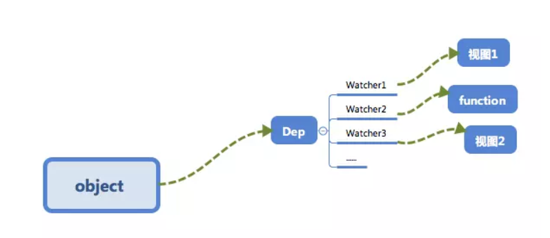
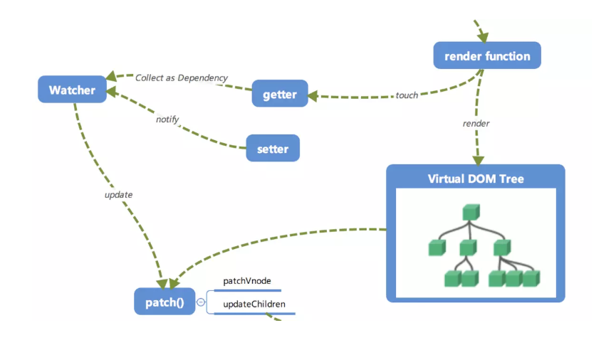

# 响应式系统的依赖收集追踪原理

## 为什么要依赖收集?

### eg

现在有这么一个 Vue 对象 

```
new Vue({
	template:
		`<div>
			<span>{{text1}}</span>
			<span>{{text2}}</span>
		</div>`,
	date:{
		text1:'text1',
		text2:'text2',
		text3:'text3'
	}
})
```

然后做了这么一个操作
```
this.text3 = 'modify text3';
```

修改了 `data` 中 `text3` 的数据, 但是因为视图中并不需要用到 `text3`, 所以并不需要触发上章所讲的 `cb` 函数来更新视图, 调用 `cb` 显然是不正确的.

### eg

假设现在有一个全局的对象, 可能会在多个 Vue 对象中乃至它进行展示.

```
let globalObj = {
	text1:'text1'
}

let o1 = new Vue({
	template:
	`<div>
		<span>{{text1}}</span>
	</div>`,
	data: globalObj
})

let o2 = new Vue({
	template:
		`<div>
			<span>{{text1}}</span>
		<div>`,
	data:globalObj
})
```
这个时候执行 
```
globalObj.text1 = 'hello,text1'
```

我们应该需要通知`o1`以及`o2`两个vm实例进行视图的更新, [依赖收集] 会让 `text1` 这个数据知道 "有两个数据依赖我拉数据 , 我我变化的时候需要通知它们".



接下来我们介绍 [依赖收集] 是如何实现的.

### 订阅者 Dep
首先来实现一个订阅都 Dep, 它的主要作用是用来存放 `Watcher` 观察都对象
```
class Dep{
	constructor(){
		// 用来存放 Watcher 对象的数组
		this.subs = [];
	}

	// 在 subs 中添加一个 Watcher 对象
	addSub (sub){
		this.subs.push(sub);
	}

	// 通知所有 Watcher 对象更新视图
	notify(){
		this.subs.forEach((sub)=>{
			sub.update();
		})
	}
}
```

为了便于理解我们只实现了添加的部分代码, 主要是两件事情:
1. 用 `addSub` 方法可以在目前的 `Dep` 对象中增加一个 `Watcher` 的订阅操作;
2. 用 `notify` 方法通知目前 `Dep` 对象的 `subs` 的所有 `Wathcer` 对象触发更新操作.

## 观察者 Watcher
```
class Watcher{
	constructor(){
		// 在 new 一个 Watcher 对象时将该对象赋值给 Dep.targe, 在 get 中会用到
		Dep.target = this;
	}

	// 更新视图的方法
	update(){
		console.log('视图更新')
	}
}

Dep.target = null;
```

## 依赖收集
接下来修改一个 `defineReactive` 以及 Vue 的构造函数, 来完成依赖收集.

在闭包中增加了一个 Dep 类的对象 , 用来收集 `Watcher` 对象. 在对象被  [读] 的时候, 会触发 `reactiveGetter` 函数把当前的 `Watcher` 对象 (存放在 Dep.target 中) 收集到 `Dep` 类中去. 之后 如果当该对象被 [**写**] 的时候 则会触发 `reactiveSetter` 方法, 通知 `Dep` 类调用 `notify` 来触发所有 `Watcher` 对象的 `update` 方法更新对应视图.

```
function defineReactive(obj,key,val){
	// 一个 Dep 类对象 
	const dep = new Dep();

	Object.defineProperty(obj,key,{
		enumerable: true, // 可枚举
		configurable:true, // 可配置
		get:function reactiveGetter(){
			// 将 Dep.targe (即当前 的 Watcher 对象存入 dep 的 subs 中)
			dep.addSub(Dep.target);
			return val;
		},
		set:function reactiveSetter(newVal){
			if(newVal === val) return;
			// 在 set 的时候触发 dep 的 notify 来通知所有的 Watcher 对象更新视图
			dep.notify();
		}
	})
}

class Vue{
	constructor (options){
		this._data = options.data;
		observer(this._data);
		// 新建一个 Watcher 观察者对象, 这时候  Dep.target 会指向这个 Watcher 对象 
		new Watcher();
		// 这时模拟 render 的过程 , 为了触发 test 属性的 get 函数
		console.log('render~',this._data.test);
	}
}
```

## 小结

总结一下. 

首先在 `observer` 的过程中会注册 `get` 方法, 该方法 用来进行 [**依赖收集**]. 在它的闭包中会有一个 `Dep`(数据依赖) 对象, 这个对象用来存放 Watcher 对象 的实例. 其实 [**依赖nhwy**] 的过程就是把 `Watcher` 实例存放到对应的 `Dep` 对象中去. `get` 方法可以让当前的 `Watcher` 对象(Dep.target) 存放到它的 subs中 (`addsub`)方法, 在数据变化时, `set` 会调用 `Dep` 对象的 `notify` 方法通知它内部所有的 `Watcher` 对象进行视图更新.

这是 `Object.defineProperty` 的 `set/get` 方法处理的事件, 那么 [**依赖收集**] 的前提条件还有两个:

- 1. 触发 `get` 方法
- 2. 新建一个 Watcher 对象 

这个在 Vue 的构造类中处理. 新建一个 `Watcher` 对象只需要 new 出来, 这时候 `Dep.target` 已经指向了这个 new 出来的 `Watcher` 对象来. 而触发 `get` 方法也很简单, 实际上只要把 render function 进行渲染, 那么其中的依赖对象都会被 [读取] , 这里通过打印来模拟这个过程, 读取 test 来触发 `get` 进行[依赖收集].

本章介绍了 [依赖收集] 的过程,配合之前的响应式原理, 已经把整个 [响应式系统] 介绍完毕了. 其主要就是 `get` 进行 [依赖收集]. `set` 通过观察者来更新视图, 配合下图

