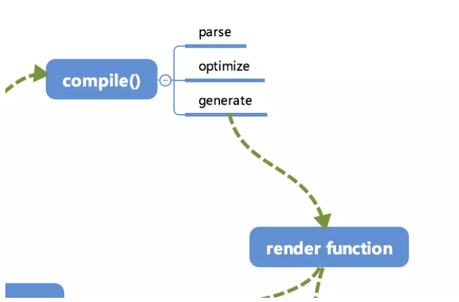
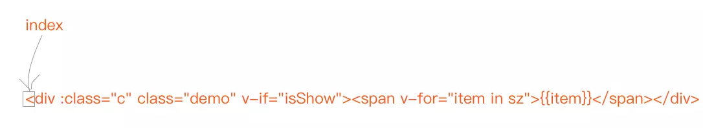
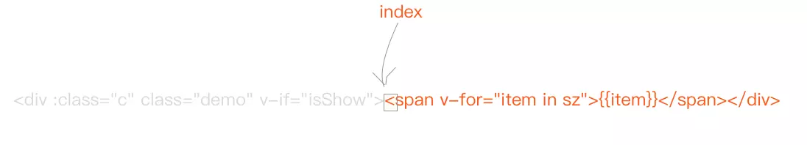
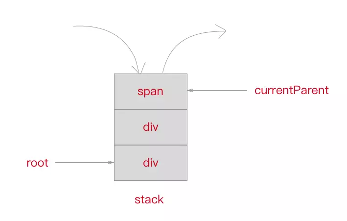

# template 模板是怎样通过 Compile 编译的

## Compile
`compile` 编译可以分成 `parse`、`optimize`与`generate`三人阶段,最终需要得到 render function. 这部分内容不算 Vue.js 的响应式核心, 只是用来 编译的



由解析过程比较复杂, 直接上代码可能会不了解这部分内容的同学一头雾水. 所以准备提供一个 template 的示例, 通过这个示例的变化来看解析的过程. 但是解析的过程及结果都是将最重要的部分抽离出来展示, 希望让读者更好地了解其核心部分的实现.

```
<div :class="c" class="demo" v-if="isShow">
	<span v-for="item in sz">{{item}}</span>
</div>
```
```
var html = '<div :class="c" class="demo" v-if="isShow"><span v-for="item in sz">{{item}}</span></div>';
```
接下来的过程都会依赖这个示例来进行.

## parse(分析)

首先是 `parse`,`parse`会用正则等 方式将template模板中进行字符串解析, 得到指令、class、style等数据, 形成 AST(抽象语法树).

这个过程比较复杂, 会涉及到比较多的正则进行字符串解析
```
{
	// 标签属性的map, 记录了标签上属性
	'attrsMap':{
		':class':'c',
		'class':'demo',
		'v-if':'isShow'
	},
	// 解析得到的 :class
	'classBinding':'c',
	// 标签属性 v-if
	'if':'isShow',
	// v-if 的条件
	'ifConditions':[
		{
			'exp':'isShow'
		}
	],
	// 标签属性 class
	'staticClass':'demo',
	// 标签的 tag
	'tag':'div',
	// 子标签数组
	'children':[
		{
			'attrsMap':{
				'v-for':"item in sz"
			},
			// for 循环的参数
			'alias':"item",
			// for 循环的对象
			'for':'sz',
			// for 循环是否已经被处理的标记位
			'forProcessed':true,
			'tag':'span',
			'children':[
				{
					// 表达式, _s是一个转字符串的函数
					'expression':'_s(item)',
					'text':'{{item}}'
				}
			]
		}
	]
}
```

最终得到的AST通过一引起特定的属性,能够比较清晰地描述出标签的属性以及依赖关系

下面用代码来讲解一下如何使用正则来把 template 编译成我们需要的 AST 的.

### 正则

首先我们定义一下接下来用到的正则
```
const ncname = '[a-zA-Z_][\\w\\-\\.]*';
const singleAttrIdentifier = /([^\s"'<>/=]+)/
const singleAttrAssign = /(?:=)/
const singleAttrValues = [
  /"([^"]*)"+/.source,
  /'([^']*)'+/.source,
  /([^\s"'=<>`]+)/.source
]
const attribute = new RegExp(
  '^\\s*' + singleAttrIdentifier.source +
  '(?:\\s*(' + singleAttrAssign.source + ')' +
  '\\s*(?:' + singleAttrValues.join('|') + '))?'
)

const qnameCapture = '((?:' + ncname + '\\:)?' + ncname + ')'
const startTagOpen = new RegExp('^<' + qnameCapture)
const startTagClose = /^\s*(\/?)>/

const endTag = new RegExp('^<\\/' + qnameCapture + '[^>]*>')

const defaultTagRE = /\{\{((?:.|\n)+?)\}\}/g

const forAliasRE = /(.*?)\s+(?:in|of)\s+(.*)/...
```

## advance 发展

因为我们解析 template 采用循环进行字符串匹配的方式, 所以每匹配解析完一段我们需要将已经匹配掉的去掉, 头部的指针向接下来需要匹配的部分.

```
function advance(n){
	index +=n 
	html = html.substring(n)
}
```
举个例子, 当我们把第一个 div 的头标签全部匹配完毕以后, 需要将这部分除去,也就是向右移动 43个字符.



调用 `advance` 函数
```
advance(43);
```
得到结果



### parseHTML 分析HTML

首先需要定义个 `parseHTML` 函数,在里面 循环解析 template 字符串.
```
function parseHTML(){
	while(html){
		// String.indexOf('<')  返回索引,否则 -1
		let textEnd = html.indexOf('<');
		if(textEnd === 0){
			// String.match(str/regExp)
			// 在字符串内检索指定的值,或找到一个或多个正则表达式的匹配, 返回指定的值
			// 'abcd'.match('a')  // ['a']
			// /abcda'.match(/a/g) // ['a','a']  正则的时候依赖 g
			if(html.match(endTag)){
				// ... process end tag
				continue;
			}
			if(html.match(startTagOpen)){
				// ...process start tag
				continue;
			}
		}else{
			// ... process text
			continue;
		}
	}
}
```

`parseHTML`会用 `while` 来循环解析 template , 用正则在匹配到标签头 标签尾以及文本的时候分别进行不同的处理. 直到整个 template 被 解析完毕.


### parseStartTag
 
写一个 `parseStartTag` 函数, 用来解析起始标签 (`<div :class="c" class="demo" v-if="isShow">`部分的内容).

```
function parseStartTag(){
	const start = html.match(startTagOpen);
	if(start){
		const match = {
			tagName: start[1],
			attrs:[],
			start:index
		}
		advance(start[0].length);

		let end,attr
		while(!(end = html.match(startTabClose)) && (attr = html.match(attribute))){
			advance(attr[0].length)
			match.attrs.push({
				name:attr[1],
				value:attr[3]
			});
		}
		if(end){
			match.unarySlash = end[1];
			advance(end[0].length);
			match.end = index;
			return match
		}
	}
}
```
首先用 `startTagOpen` 正则得到标签的头部,可以得到`tagName`(标签名称),同时我们需要一个数组 `attrs`用来存放标签内的属性.

```
const start = html.match(startTagOpen);
const match = {
	tagName:start[1],
	attrs:[],
	start:index
}
advance(start[0].length);
```
接下来使用`startTagClose`与`attribute`两个正则分别用来解析标签结束以及标签内的属性. 这段代码用`while` 循环一直到匹配到`startTagClose`为止, 解析内部所有的属性.
```
let end,attr;
while(!(end = html.match(startTagClose))&&(attr = html.match(attribute)))){
	advance(attr[0].length)
	match.attrs.push({
		name:attr[1],
		value:attr[3]	
	})
}
if(end){
	match.unarySlash = end[1];
	advance(end[0].length);
	match.end = index;
	return match
}
```

## stack 堆
此外,我们需要一个 **stack** 栈来保存已经解析好的标签头,这样可以根据在解析发问标签的时候得到所属的层级关系以及父标签. 同时我们定义一个 `currentParent` 变量来存放 当前标签的父标签节点的引用 , `root`变量用来 指向根标签节点.
```
const stack = [];
let currentParent, root;
```



知道这个以后, 优化一下 `parseHTML` , 在 `startTagOpen` 的 `if` 逻辑中加上新的处理.
```
if (html.match(startTagOpen)) {
    const startTagMatch = parseStartTag();
    const element = {
        type: 1,
        tag: startTagMatch.tagName,
        lowerCasedTag: startTagMatch.tagName.toLowerCase(),
        attrsList: startTagMatch.attrs,
        attrsMap: makeAttrsMap(startTagMatch.attrs),
        parent: currentParent,
        children: []
    }

    if(!root){
        root = element
    }

    if(currentParent){
        currentParent.children.push(element);
    }

    stack.push(element);
    currentParent = element;
    continue;
}
```

